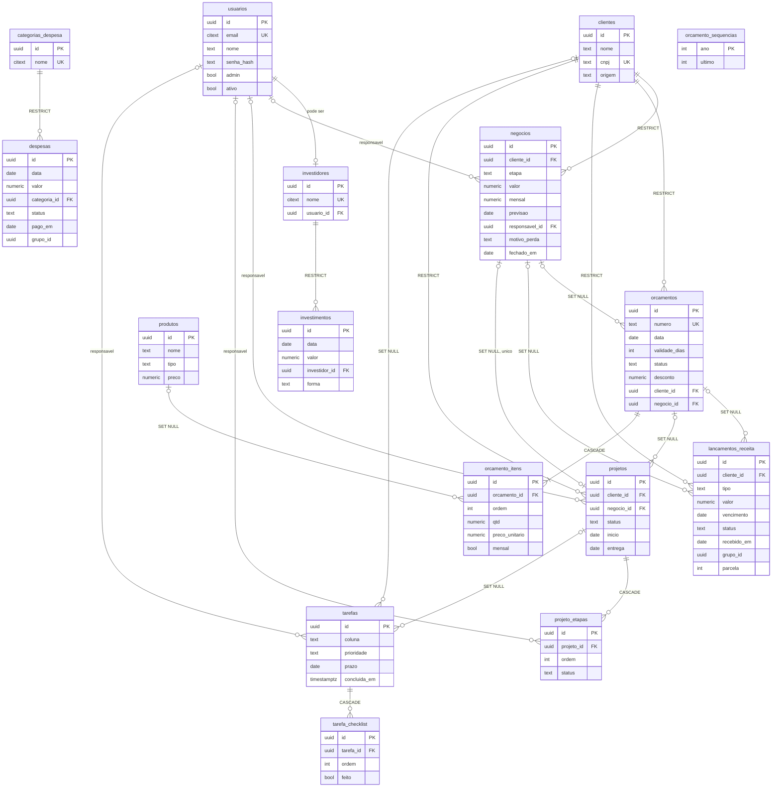

# Banco de dados - Hub Comercial iSolutis

PostgreSQL 16, schema `public`. Migração inicial: `backend/migrations/sql/0001_schema_inicial.sql` (reversão: `..._down.sql`). Testes: `backend/tests_sql/test_schema.sql`.

## 1. Princípios e decisões

| Decisão | Escolha | Por quê | Alternativas descartadas |
|---|---|---|---|
| Modelo | Relacional normalizado, integridade no banco (PK, FK, CHECK, UNIQUE) | O legado (`hub_*` com `dados jsonb`) não garantia nada: cliente órfão, etapa inválida, números duplicados. Com ~4 usuários, o ganho é correção, não escala. | Manter JSONB (sem integridade); híbrido jsonb+colunas (dupla fonte de verdade). |
| Chave primária | `uuid` com `gen_random_uuid()` (v4, nativo, sem extensão) | O front usa o id em URLs: UUID não é enumerável nem revela volume; permite o backend gerar ids antes do INSERT (lotes de parcelas, ids de série); não colide ao fundir dados legados. Com volume minúsculo, a localidade de índice do v7 é irrelevante. O backend pode gerar UUIDv7 se quiser: a coluna aceita qualquer uuid. | `bigint identity` (URLs previsíveis, exige vazar ordem; mais simples de ler); UUIDv7 no banco (só existe nativo no PG18). |
| Enumerações | `text` + `CHECK (col IN (...))`, com nomes `ck_<tabela>_<regra>` | Mudar um ENUM nativo exige `ALTER TYPE` (não remove valor, não roda em transação em versões antigas, complica Alembic autogenerate). Um CHECK é trocado com `DROP/ADD CONSTRAINT` na migração. Conjuntos fixos do domínio (etapa, status, tipo, origem). | `CREATE TYPE ... AS ENUM`. |
| Conjuntos editáveis | Tabela de domínio: **`categorias_despesa`** (semeada com as 10 do legado) | O usuário deve poder criar/inativar categorias sem migração; `despesas.categoria_id` RESTRICT mantém histórico. | CHECK de texto (exigiria deploy para cada categoria). |
| Dinheiro / qtd / datas | `numeric(14,2)` / `numeric(12,3)` / `date` para datas de negócio / `timestamptz` para carimbos | Sem float. `date` evita problema de fuso em vencimentos. | `money`, `float`, `timestamp` sem fuso. |
| Soft delete | Não. Exclusão física com FK explícita | Requisito. RESTRICT onde o app bloqueia; CASCADE para filhos de composição; SET NULL para vínculos opcionais. | `deletado_em`. |
| Pessoas | Só `usuarios` (login). Responsáveis = FK `usuarios` nullable. Investidores = tabela `investidores` com `usuario_id` opcional | Responsável era texto livre ("Jeff"/"Jefferson"). | Texto livre; ENUM de sócios. |
| E-mail | `citext` (+ UNIQUE) | Unicidade case-insensitive sem lembrar de `lower()` em toda query. | Índice em `lower(email)`. |
| Despesas x investimentos | **Duas tabelas** (`despesas`, `investimentos`) | Atributos disjuntos: despesa tem categoria/status/pago_em/fornecedor/série; investimento tem investidor/forma. Em tabela única seriam colunas nullable com CHECK condicional por tipo (frágil) e toda soma exigiria filtrar tipo: esquecer o filtro mistura aporte com custo no resultado. Separadas, `NOT NULL` e FKs valem direto e "resultado = recebido - despesas pagas" é um `SUM` simples. | Tabela única com `tipo` + CHECKs; supertipo `movimentos_financeiros` com subtabelas (3 tabelas e joins sem consulta que peça isso). |
| Investidor | Tabela `investidores(nome, usuario_id nullable unique)` | "Total investido por investidor" vira `GROUP BY investidor_id` (sem divergência de grafia); sócios externos existem sem criar login; usuário excluído não apaga o histórico de aportes. | `investidor_id -> usuarios` + nome livre (duas fontes, `GROUP BY coalesce`, SET NULL perde identidade). |
| `faturado` do negócio | **Derivado**: `EXISTS (SELECT 1 FROM lancamentos_receita WHERE negocio_id = :id)` | Flag armazenada diverge dos lançamentos (apagar lançamentos deixaria `faturado=true`). O índice parcial `ix_lancamentos_receita_negocio` torna o EXISTS barato. | Coluna booleana. |
| Receita | Tabela **`lancamentos_receita`** | "Faturamento" é o ato de faturar; a linha é um lançamento com ciclo previsto -> recebido, simétrico a `despesas` (a_pagar -> pago). | `faturamento`, `receitas`, `contas_receber`. |
| Parcelas / lotes | Colunas `grupo_id uuid`, `parcela`, `total_parcelas` em `lancamentos_receita` e `despesas` | O backend gera o lote em um único `INSERT ... SELECT generate_series` (atômico). `grupo_id` identifica a *série* (um por tipo: N parcelas de projeto e N mensalidades são 2 séries). CHECK: os 3 campos são todos NULL ou todos preenchidos, `1 <= parcela <= total`; `UNIQUE (grupo_id, parcela)` impede duplicar parcela. Série = rótulo, não entidade: tabela `series` só acrescentaria joins e FKs sem atributos próprios. | Tabela de grupos; texto "3/12" em `descricao`. |
| FKs compostas cliente/negócio | `orcamentos`, `lancamentos_receita`, `projetos` referenciam `(negocio_id, cliente_id)` -> `negocios(id, cliente_id)` e `(orcamento_id, cliente_id)` -> `orcamentos(id, cliente_id)`, com `ON DELETE SET NULL (negocio_id)` (PG15+) | Impossível ligar um orçamento/lançamento/projeto de um cliente a um negócio de outro. O SET NULL por coluna não zera `cliente_id` (NOT NULL). Consequência: não se troca o `cliente_id` de um negócio que já tem filhos (erro 23503): é intencional. | FK simples + validação no app. |
| `escopo`, `entregaveis` | **Texto** (1 item por linha) | O app edita em textarea; não há estado por item, consulta por item nem referência externa. Normalizar obrigaria diff linha a linha a cada salvamento sem ganho. Se virarem checklist com estado, promover a tabela (como `tarefa_checklist`, normalizada justamente por ter `feito`). | Tabelas `projeto_escopo_itens`, `etapa_entregaveis`. |
| Ordem reordenável | `UNIQUE (pai_id, ordem) DEFERRABLE INITIALLY DEFERRED` em `orcamento_itens`, `projeto_etapas`, `tarefa_checklist` | Reordenar = vários UPDATEs na mesma transação sem colisão intermediária. Efeito colateral: não serve como árbitro de `ON CONFLICT`. | Unique imediato (exige ordem temporária); lista ligada. |
| `vencido` | Derivado na view (`status='enviado' AND data + validade_dias < current_date`) | Armazenar envelhece sozinho. Usa o fuso da sessão: o backend deve usar `America/Sao_Paulo`. | Coluna / job. |
| Prioridade da tarefa | `text` ('alta','media','baixa') + coluna gerada `prioridade_ordem smallint` (1..3) | `ORDER BY prioridade` alfabético daria alta, baixa, media. | Ordenar com CASE em toda query. |
| Busca de tarefas | Coluna gerada `busca` (título + descrição, minúsculo, sem acento via `imm_unaccent`) + GIN `gin_trgm_ops` | Busca parcial e sem acento ("reuniao" acha "Reunião") com índice. | `to_tsvector` (não acha prefixo digitado pela metade); ILIKE sem índice. |
| Auditoria | Trigger genérico `set_audit()` + GUC `app.usuario_id` | Seção 4. | Auditar no ORM (burlável por SQL direto). |
| Ids legados | Tabela temporária `legado_ids(colecao, legacy_id, novo_id)` | Seção 9. | Coluna `legacy_id text unique` em cada tabela. |

Convenção de nomes de constraints/índices (para `MetaData(naming_convention=...)` no SQLAlchemy): `pk_<tabela>`, `uq_<tabela>_<cols>`, `ck_<tabela>_<regra>`, `fk_<tabela>_<coluna|referente>`, `ix_<tabela>_<cols>`.

## 2. Diagrama ER

Todas as tabelas de negócio têm também `criado_em, atualizado_em, criado_por, atualizado_por, versao` (omitidas do diagrama; `criado_por`/`atualizado_por` -> `usuarios`).



## 3. Dicionário de dados

Convenções: **NN** = NOT NULL. Colunas de auditoria (todas as tabelas exceto `orcamento_sequencias` e `legado_ids`): `criado_em timestamptz NN default now()`, `atualizado_em timestamptz NN default now()`, `criado_por uuid -> usuarios` (SET NULL), `atualizado_por uuid -> usuarios` (SET NULL), `versao integer NN default 1`. Todas mantidas pelo trigger (seção 4); o backend nunca as escreve.

### usuarios
| Coluna | Tipo | Nulo? | Regra |
|---|---|---|---|
| id | uuid | NN | PK |
| email | citext | NN | UNIQUE (case-insensitive); formato `x@y` |
| nome | text | NN | não vazio |
| senha_hash | text | sim | NULL = convite sem senha |
| senha_definida | boolean | gerada | `senha_hash IS NOT NULL` (stored) |
| admin | boolean | NN | default false |
| ativo | boolean | NN | default true; "membro" = usuário ativo |
| ultimo_acesso | timestamptz | sim | mudança isolada não incrementa `versao` |

### categorias_despesa
`id` PK; `nome citext NN UNIQUE`; `ordem int NN default 0`; `ativo bool NN default true`. Semeada: Servidores e infraestrutura, Softwares e assinaturas, Pessoal e terceiros, Impostos e taxas, Contabilidade, Marketing e anúncios, Escritório, Equipamentos, Deslocamento, Outros.

### investidores
`id` PK; `nome citext NN UNIQUE`; `usuario_id uuid UNIQUE -> usuarios` (SET NULL; sócio da equipe); `ativo bool NN default true`.

### clientes
| Coluna | Tipo | Nulo? | Regra |
|---|---|---|---|
| id | uuid | NN | PK |
| nome | text | NN | não vazio |
| cnpj | text | sim | 14 dígitos sem máscara; UNIQUE parcial (quando não nulo) |
| segmento, contato, cargo, telefone, email, cidade, obs | text | sim | livres (`telefone` = WhatsApp) |
| origem | text | sim | Site, Indicação, LinkedIn, Instagram, WhatsApp, Evento, Prospecção ativa, Outro |

### produtos
`id` PK; `nome text NN`; `tipo text NN` (projeto, mensal, consultoria, outro); `unidade text NN default 'projeto'` (livre); `preco numeric(14,2) NN default 0 CHECK >= 0`; `ativo bool NN default true`; `descricao text`.

### negocios
| Coluna | Tipo | Nulo? | Regra |
|---|---|---|---|
| id | uuid | NN | PK; `UNIQUE (id, cliente_id)` para FKs compostas |
| titulo | text | NN | não vazio |
| cliente_id | uuid | NN | FK clientes RESTRICT |
| etapa | text | NN | lead (default), diag_agendado, diag_feito, proposta, negociacao, ganho, perdido |
| valor, mensal | numeric(14,2) | NN | default 0, `>= 0` |
| previsao | date | sim | previsão de fechamento |
| responsavel_id | uuid | sim | FK usuarios SET NULL |
| origem | text | sim | mesma lista de clientes |
| motivo_perda | text | sim | Preço, Prazo, Escolheu concorrente, Adiou o projeto, Sem resposta, Fora do perfil; **preenchido se e somente se `etapa='perdido'`** |
| obs | text | sim | |
| fechado_em | date | sim | só com `etapa='ganho'` |

### orcamentos
| Coluna | Tipo | Nulo? | Regra |
|---|---|---|---|
| id | uuid | NN | PK; `UNIQUE (id, cliente_id)` |
| numero | text | NN | UNIQUE; `^[0-9]{4}-[0-9]{3,}$`; gerado (seção 6); imutável |
| data | date | NN | default `current_date` |
| validade_dias | integer | NN | default 15, `> 0` |
| status | text | NN | rascunho (default), enviado, aprovado, recusado |
| desconto | numeric(14,2) | NN | default 0, `>= 0`; abate só o total do projeto |
| obs | text | sim | condições |
| cliente_id | uuid | NN | FK clientes RESTRICT |
| negocio_id | uuid | sim | FK composta (negocio_id, cliente_id), SET NULL (negocio_id) |
| aprovado_em | date | sim | só com `status='aprovado'` |

### orcamento_itens
`id` PK; `orcamento_id NN -> orcamentos` CASCADE; `ordem int NN` (`UNIQUE (orcamento_id, ordem)` deferrable); `produto_id -> produtos` SET NULL; `descricao text NN`; `qtd numeric(12,3) NN default 1 CHECK > 0`; `preco_unitario numeric(14,2) NN default 0 CHECK >= 0`; `mensal bool NN default false`; `subtotal numeric(14,2)` **gerada** `round(qtd * preco_unitario, 2)`.

### orcamento_sequencias
`ano integer PK` (1000..9999); `ultimo integer NN default 0 CHECK >= 0`. Sem auditoria (tabela técnica).

### lancamentos_receita
| Coluna | Tipo | Nulo? | Regra |
|---|---|---|---|
| id | uuid | NN | PK |
| cliente_id | uuid | NN | FK clientes RESTRICT |
| tipo | text | NN | projeto, mensal, consultoria, outro |
| descricao | text | NN | não vazio |
| valor | numeric(14,2) | NN | `>= 0` |
| vencimento | date | NN | legado `data` |
| status | text | NN | previsto (default), recebido |
| recebido_em | date | sim | **preenchido se e somente se `status='recebido'`** |
| nf | text | sim | nota fiscal / observação |
| negocio_id, orcamento_id | uuid | sim | FKs compostas com cliente_id, SET NULL na coluna |
| grupo_id, parcela, total_parcelas | uuid, int, int | sim | todos NULL ou todos preenchidos; `1 <= parcela <= total_parcelas`; `UNIQUE (grupo_id, parcela)` |

### despesas
`id` PK; `data date NN`; `descricao text NN`; `valor numeric(14,2) NN >= 0`; `categoria_id NN -> categorias_despesa` RESTRICT; `status text NN default 'a_pagar'` (pago, a_pagar); `pago_em date` (**preenchido se e somente se `status='pago'`**); `fornecedor text`; `obs text`; `grupo_id/parcela/total_parcelas` (mesma regra dos lançamentos; recorrência "todo mês por N meses").

### investimentos
`id` PK; `data date NN`; `descricao text NN`; `valor numeric(14,2) NN >= 0`; `investidor_id NN -> investidores` RESTRICT; `forma text NN` (Dinheiro (aporte), Equipamento, Pagamento de despesa da empresa, Outro); `obs text`.

### projetos
| Coluna | Tipo | Nulo? | Regra |
|---|---|---|---|
| id | uuid | NN | PK |
| titulo | text | NN | |
| cliente_id | uuid | NN | FK RESTRICT |
| negocio_id | uuid | sim | `UNIQUE` (no máx. 1 projeto por negócio; NULLs não colidem); FK composta, SET NULL |
| orcamento_id | uuid | sim | FK composta, SET NULL |
| status | text | NN | planejamento (default), construcao, validacao, entregue, pausado |
| responsavel_id | uuid | sim | FK usuarios SET NULL |
| inicio, entrega | date | sim | `entrega >= inicio` quando ambos |
| objetivo, escopo, fora_escopo, pos_entrega | text | sim | `escopo`: 1 item por linha; `pos_entrega` sem default (default textual fica no backend) |

### projeto_etapas
`id` PK; `projeto_id NN -> projetos` CASCADE; `ordem int NN` (`UNIQUE (projeto_id, ordem)` deferrable); `titulo text NN`; `status text NN default 'a_fazer'` (a_fazer, andamento, concluida); `responsavel_id -> usuarios` SET NULL; `inicio`, `fim date` (`fim >= inicio` quando ambos); `descricao text`; `entregaveis text` (1 por linha).

### tarefas
| Coluna | Tipo | Nulo? | Regra |
|---|---|---|---|
| id | uuid | NN | PK |
| titulo | text | NN | |
| coluna | text | NN | a_fazer (default), fazendo, revisao, concluido |
| responsavel_id | uuid | sim | FK usuarios SET NULL |
| prazo | date | sim | |
| prioridade | text | NN | alta, media (default), baixa |
| prioridade_ordem | smallint | gerada | alta=1, media=2, baixa=3 |
| cliente_id, projeto_id | uuid | sim | FK SET NULL |
| descricao | text | sim | |
| concluida_em | timestamptz | sim | **preenchida se e somente se `coluna='concluido'`** |
| busca | text | gerada | `imm_unaccent(lower(titulo || ' ' || coalesce(descricao,'')))` |

### tarefa_checklist
`id` PK; `tarefa_id NN -> tarefas` CASCADE; `ordem int NN` (`UNIQUE (tarefa_id, ordem)` deferrable); `texto text NN`; `feito bool NN default false`.

### legado_ids (temporária)
`colecao text`, `legacy_id text`, `novo_id uuid`, `criado_em timestamptz`; PK `(colecao, legacy_id)`, `UNIQUE (colecao, novo_id)`.

## 4. Auditoria e concorrência otimista

**Contrato com o backend.** Em toda transação que escreve, antes do primeiro INSERT/UPDATE/DELETE:

```sql
SELECT set_config('app.usuario_id', '<uuid do usuário autenticado>', true);  -- true = local à transação (equivale a SET LOCAL)
```

Use `set_config(..., true)` e não `SET LOCAL`, pois `SET` não aceita parâmetro vinculado (bind). Vale só até o COMMIT/ROLLBACK, então é seguro com pool/PgBouncer em modo transação. Sem a variável, `app_usuario_id()` devolve NULL e `criado_por/atualizado_por` ficam como o chamador informou (ou NULL). A função `app_usuario_id()` lê o valor.

**Trigger `set_audit()`** (BEFORE INSERT OR UPDATE, FOR EACH ROW, `tg_<tabela>_audit`):
- INSERT: `versao=1`, `criado_em=atualizado_em=now()`, `criado_por=atualizado_por=app_usuario_id()` (o valor da sessão prevalece sobre o enviado).
- UPDATE: `criado_em` e `criado_por` imutáveis (o único movimento permitido em `criado_por` é virar NULL, que é a ação referencial `ON DELETE SET NULL` quando um usuário é excluído); `versao = OLD.versao + 1`; `atualizado_em = now()`; `atualizado_por = app_usuario_id()`. Valores de auditoria enviados pelo cliente são ignorados.
- UPDATE sem mudança real em colunas de negócio (comparação via `to_jsonb`, ignorando colunas de auditoria e geradas), p.ex. `SET nome = nome` ou a ação referencial que zera `criado_por`, **não** incrementa `versao`. `usuarios` ignora também `ultimo_acesso` (`set_audit('ultimo_acesso')`), para o login não gerar "outra pessoa alterou o registro".
- Modo carga de legado: `SELECT set_config('app.preservar_auditoria', 'on', true)` faz o trigger preservar `criado_em/atualizado_em/criado_por/atualizado_por/versao` informados (somente na migração de dados).

**Concorrência otimista.** O front lê `versao` junto com o registro e devolve na edição. O backend executa:

```sql
UPDATE clientes SET nome = :nome, ... WHERE id = :id AND versao = :versao_lida;
-- rowcount = 0  =>  409 "outra pessoa alterou o registro"
```

Com SQLAlchemy: `__mapper_args__ = {"version_id_col": versao, "version_id_generator": False}` (o trigger faz o incremento; com gerador `+1` padrão o valor coincide). Efeito colateral intencional: ações referenciais que mudam colunas de negócio (ex.: `responsavel_id` virou NULL porque o usuário foi excluído) contam como edição e incrementam `versao`. Prefira **desativar** usuário (`ativo=false`) a excluí-lo.

## 5. Política de chaves estrangeiras

| FK | ON DELETE | Motivo |
|---|---|---|
| negocios.cliente_id, orcamentos.cliente_id, lancamentos_receita.cliente_id, projetos.cliente_id | RESTRICT | Cliente com negócios/faturamento não pode ser excluído (regra do legado). Estendido a orçamentos e projetos (o legado deixava órfãos): a API deve responder 409. |
| orcamentos/lancamentos_receita/projetos -> negocios (composta) | SET NULL (negocio_id) | Excluir um negócio não apaga financeiro, orçamento nem projeto. |
| lancamentos_receita/projetos -> orcamentos (composta) | SET NULL (orcamento_id) | Idem. |
| orcamento_itens.orcamento_id | CASCADE | Filho de composição. |
| orcamento_itens.produto_id | SET NULL | A `descricao` do item preserva o histórico. |
| projeto_etapas.projeto_id, tarefa_checklist.tarefa_id | CASCADE | Filhos de composição. |
| tarefas.cliente_id, tarefas.projeto_id | SET NULL | Vínculo opcional. |
| despesas.categoria_id, investimentos.investidor_id | RESTRICT | Histórico financeiro não perde classificação. |
| negocios/projetos/projeto_etapas/tarefas.responsavel_id, investidores.usuario_id, criado_por, atualizado_por | SET NULL | Excluir usuário não apaga dados. |

## 6. Numeração de orçamentos

Tabela `orcamento_sequencias(ano, ultimo)` e função `proximo_numero_orcamento(p_ano integer default ano corrente) returns text`:

```sql
INSERT INTO orcamento_sequencias AS s (ano, ultimo) VALUES (p_ano, 1)
ON CONFLICT (ano) DO UPDATE SET ultimo = s.ultimo + 1 RETURNING s.ultimo;   -- retorna 'AAAA-NNN'
```

O upsert é atômico e trava a linha do ano até o fim da transação: dois criadores simultâneos são serializados, nunca recebem o mesmo número, e um ROLLBACK devolve o número (sem buracos). Uso pelo backend, na **mesma transação** do INSERT: ou `INSERT INTO orcamentos (..., numero) VALUES (..., proximo_numero_orcamento(<ano de data>))`, ou simplesmente omitir/enviar `NULL` em `numero`: o trigger `tg_orcamentos_numero` gera a partir do ano de `data` (com SQLAlchemy, use `server_default=FetchedValue()` e `RETURNING numero`, ou chame a função explicitamente). Para números informados (carga do legado), o trigger avança a sequência para `max(ultimo, número informado)`. `numero` é imutável após o INSERT. O padrão `AAAA-NNN` passa a `AAAA-NNNN` após 999 (CHECK aceita 3+ dígitos).

## 7. Views

- **`vw_orcamentos_totais`**: `id, numero, data, validade_dias, validade_ate, status, vencido, desconto, cliente_id, cliente_nome, negocio_id, aprovado_em, qtd_itens, subtotal_projeto, total_projeto, total_mensal`. `total_projeto = greatest(0, soma(subtotal dos itens não mensais) - desconto)`; `total_mensal = soma(subtotal dos itens mensais)`; `vencido = status='enviado' AND data + validade_dias < current_date`. Lista: `ORDER BY numero DESC`. Aguardando: `WHERE status='enviado'`. Arredondamento é por item (`subtotal` gerado), então o front deve somar subtotais de 2 casas, não recalcular em float.
- **`vw_projetos_progresso`**: `projeto_id, total_etapas, etapas_concluidas, progresso_pct` (inteiro 0..100, arredondado; 0 sem etapas).

## 8. Índices e a consulta que justifica cada um

PKs e UNIQUEs não são repetidos. Não há índice em FKs raramente consultadas (ex.: `responsavel_id` de negócios/projetos, `produto_id`, `categoria_id`): as tabelas têm centenas de linhas e a varredura sequencial no `ON DELETE` é desprezível.

| Índice | Consulta |
|---|---|
| uq_usuarios_email | login por e-mail |
| uq_clientes_cnpj (parcial, cnpj não nulo) | impedir cliente duplicado / achar por CNPJ |
| ix_negocios_etapa_previsao `(etapa, previsao)` | kanban por etapa ordenado por previsão; soma de valor/mensal por etapa |
| ix_negocios_cliente `(cliente_id)` | negócios abertos por cliente; checagem do RESTRICT na exclusão de cliente |
| ix_negocios_abertos_previsao `(previsao) WHERE etapa NOT IN ('ganho','perdido')` | "próximos fechamentos" (abertos por previsão) |
| uq_orcamentos_numero | lista por `numero DESC` (varredura reversa) e unicidade |
| ix_orcamentos_cliente `(cliente_id)` | orçamentos do cliente; RESTRICT |
| ix_orcamentos_negocio `(negocio_id) WHERE NOT NULL` | orçamentos do negócio |
| ix_orcamentos_enviados `(data) WHERE status='enviado'` | enviados aguardando resposta |
| uq_orcamento_itens_ordem `(orcamento_id, ordem)` | itens do orçamento na ordem; também serve a vw_orcamentos_totais |
| ix_lancamentos_receita_vencimento `(vencimento)` | por ano/mês; recebido x previsto por mês; recorrente por mês (`tipo='mensal'`); CSV do ano |
| ix_lancamentos_receita_cliente `(cliente_id)` | recebido por cliente; RESTRICT |
| ix_lancamentos_receita_negocio `(negocio_id) WHERE NOT NULL` | "faturado" derivado (EXISTS); lançamentos do negócio |
| uq_lancamentos_receita_grupo_parcela `(grupo_id, parcela)` | listar/editar/excluir uma série; impede parcela repetida |
| ix_despesas_data `(data)` | por ano/mês; resultado mensal |
| ix_despesas_a_pagar `(data) WHERE status='a_pagar'` | lista "a pagar" por data |
| uq_despesas_grupo_parcela `(grupo_id, parcela)` | série recorrente |
| ix_investimentos_data `(data)` | investimentos por ano/mês |
| ix_investimentos_investidor_data `(investidor_id, data)` | total investido por investidor (ano e desde o início); RESTRICT |
| ix_projetos_cliente `(cliente_id)` | projetos do cliente; RESTRICT |
| uq_projetos_negocio | 1 projeto por negócio |
| uq_projeto_etapas_ordem `(projeto_id, ordem)` | etapas ordenadas; base de vw_projetos_progresso |
| ix_tarefas_kanban `(coluna, prioridade_ordem, prazo, criado_em)` | kanban por coluna ordenado por (prioridade, prazo, criado_em) |
| ix_tarefas_abertas_responsavel `(responsavel_id, prazo) WHERE coluna<>'concluido'` | minhas tarefas abertas |
| ix_tarefas_abertas_prazo `(prazo) WHERE coluna<>'concluido' AND prazo IS NOT NULL` | atrasadas (`prazo < current_date`) |
| ix_tarefas_concluidas_recentes `(concluida_em DESC) WHERE coluna='concluido'` | concluídas recentes |
| ix_tarefas_busca GIN trigram em `busca` | `WHERE busca ILIKE '%' \|\| imm_unaccent(lower(:q)) \|\| '%'` |
| uq_tarefa_checklist_ordem `(tarefa_id, ordem)` | checklist da tarefa |

## 9. Mapeamento do legado

**Ids antigos.** Os ids `text` do legado **não** viram coluna `legacy_id` nas tabelas finais. Durante a carga, para cada linha migrada insere-se `(colecao, legacy_id, novo_id)` em `legado_ids` (`hub_membros` usa o e-mail como `legacy_id`). As FKs são reconstruídas por join nessa tabela (`hub_negocios.dados->>'clienteId'` -> `legado_ids('hub_clientes', ...)`). Vantagens: schema final sem coluna temporária repetida em 14 tabelas; um único `DROP TABLE legado_ids` (migração 0002) após validar; permite reexecutar/auditar a carga. Faça a carga com `SELECT set_config('app.preservar_auditoria','on', true)` para manter datas e autores originais.

**Autores.** `alteradoPor` / `criadoPor` (e-mails) -> `usuarios.id` por `lower(email)`; e-mail sem usuário correspondente -> NULL. `criado_em`/`atualizado_em` vêm das colunas `criado_em`/`atualizado_em` da linha legada (`atualizado_por` da coluna homônima). `versao` começa em 1.

**Responsável/investidor texto -> FK.** Normalizar (lower, sem acento, trim) e casar com `usuarios.nome` ou o primeiro nome / e-mail. Sem correspondência: `responsavel_id = NULL` e o texto original é anexado ao fim de `obs` (`[responsável legado: <texto>]`) para não perder informação. Investidores: um `investidores` por nome distinto normalizado; os que casam com um usuário recebem `usuario_id`.

**Passos de limpeza obrigatórios** (o schema novo é mais estrito que o JSON): CNPJ só dígitos (14); se não resultar em 14 dígitos, ir para `obs` e ficar NULL; CNPJ duplicado entre clientes exige decisão; datas vazias `''` -> NULL; números `null`/`''` -> 0 em valor/mensal/preco; `perdido` sem motivo -> `'Sem resposta'` (decisão sugerida); `motivo_perda` em etapa não perdida -> descartar; `fechado_em` em etapa não ganha -> NULL; status `recebido`/`pago` sem data -> usar `vencimento`/`data`; tarefas `concluido` sem `concluida_em` -> `atualizado_em`; `concluida_em` com coluna aberta -> NULL; entrega < início e fim < início -> inverter ou anular (decisão do negócio); `negocioId` de orçamento/lançamento/projeto cujo cliente difere -> anular o vínculo (a FK composta rejeita).

### hub_membros -> usuarios
`email` -> `email` (PK legada; `legacy_id`); `nome` -> `nome`; `admin` -> `admin`; `ativo` = true (membros legados são ativos); `senha_hash` NULL (senhas vinham do Supabase Auth: o usuário define no primeiro acesso, ou importe o hash bcrypt se o backend o aceitar); `ultimo_acesso` NULL.

### hub_clientes -> clientes
`nome, cnpj, segmento, contato, cargo, telefone, email, cidade, origem, obs` -> colunas homônimas (cnpj normalizado; origem fora da lista -> `'Outro'` e texto original em `obs`). `id`, `criado_em`, `atualizado_em`, `atualizado_por` -> `legado_ids` / auditoria.

### hub_produtos -> produtos
`nome, tipo, unidade, preco, ativo, descricao` -> idem (`unidade` vazia -> `'projeto'`; `preco` nulo -> 0; `ativo` nulo -> true).

### hub_negocios -> negocios
`titulo` -> `titulo`; `clienteId` -> `cliente_id` (via `legado_ids`; cliente inexistente: negócio não migra, relatar); `etapa`; `valor`; `mensal`; `previsao` -> `previsao` (date); `responsavel` (texto) -> `responsavel_id`; `origem`; `motivoPerda` -> `motivo_perda`; `obs`; `fechadoEm` -> `fechado_em` (date). **`faturado` (bool) não vira coluna**: é derivado de `EXISTS(lancamentos_receita WHERE negocio_id = ...)`. Se `faturado=true` no legado e não houver lançamentos migrados, o flag é descartado (os lançamentos são a fonte da verdade); relatar a divergência.

### hub_orcamentos -> orcamentos + orcamento_itens
`numero` -> `numero` (insere com número informado; o trigger ajusta `orcamento_sequencias`); `data`; `validadeDias` -> `validade_dias` (nulo -> 15); `status` (um eventual `vencido` armazenado vira `enviado`); `desconto`; `obs`; `clienteId`, `negocioId` -> FKs; `aprovadoEm` -> `aprovado_em`. `itens[]` (array no JSON) -> uma linha em `orcamento_itens` por elemento, `ordem` = posição no array (1..n): `produtoId` -> `produto_id` (via `legado_ids`; ausente -> NULL), `descricao`, `qtd`, `preco`/`precoUnitario` -> `preco_unitario`, `mensal` -> `mensal`.

### hub_faturamento -> lancamentos_receita
`clienteId` -> `cliente_id`; `tipo`; `descricao`; `valor`; `data` -> `vencimento`; `status`; `recebidoEm` -> `recebido_em`; `nf`; `negocioId`, `orcamentoId` -> FKs. Parcelas: o legado só tem o texto (ex.: `descricao` terminando em "3/12"); se detectado por regex `(\d+)/(\d+)\s*$` na `descricao` mais mesmo cliente/tipo/valor, agrupar com um `grupo_id` novo e preencher `parcela/total_parcelas`; caso contrário NULL nos três.

### hub_despesas -> despesas | investimentos
Dividida por `tipo`:
- `tipo='despesa'` -> `despesas`: `data`, `descricao`, `valor`, `obs`; `categoria` (texto) -> `categoria_id` (casa por nome em `categorias_despesa`; desconhecida: criar a categoria, ou `Outros`); `status`; `pago_em` -> `pago_em`; `fornecedor`. Recorrentes "parcela x/N" -> `grupo_id/parcela/total_parcelas` como acima.
- `tipo='investimento'` -> `investimentos`: `data`, `descricao`, `valor`, `obs`, `forma`; `investidor` (texto) -> `investidor_id` (find-or-create em `investidores`, ver acima).

### hub_projetos -> projetos + projeto_etapas
`titulo`; `clienteId`; `negocioId` (se dois projetos apontam o mesmo negócio, só o primeiro mantém o vínculo; relatar); `orcamentoId`; `status`; `responsavel` (texto) -> `responsavel_id`; `inicio`; `entrega`; `objetivo`; `escopo`; `foraEscopo` -> `fora_escopo`; `posEntrega` -> `pos_entrega` (texto preservado como está). `etapas[]` -> `projeto_etapas`: `ordem` = posição (1..n); `titulo`; `status`; `responsavel` -> `responsavel_id`; `inicio`; `fim`; `descricao`; `entregaveis` (texto, 1 por linha).

### hub_tarefas -> tarefas + tarefa_checklist
`titulo`; `coluna`; `responsavelId`/`responsavel` -> `responsavel_id`; `prazo`; `prioridade`; `clienteId`; `projetoId`; `descricao`; `concluidaEm` -> `concluida_em` (timestamptz). `checklist[]` -> `tarefa_checklist`: `ordem` = posição (1..n), `texto`, `feito`.

### Fora do mapeamento
Supabase Auth (identidades): migrado apenas o necessário para `usuarios`. `orcamento_sequencias` não é migrada: é recalculada pelo trigger a partir dos números inseridos. A tabela `legado_ids` é removida em 0002 após a validação.

## 10. Execução e testes

- Alembic: `op.get_bind().exec_driver_sql(open('.../0001_schema_inicial.sql').read())` (ou `op.execute(sa.text(...))`: o script evita `%` e `:nome` para não colidir com bind params). O script não tem BEGIN/COMMIT: rode dentro da transação do Alembic (`transactional_ddl`). Requer PG15+ e permissão para criar as extensões `citext`, `pg_trgm`, `unaccent` (todas "trusted").
- Via psql: `psql -v ON_ERROR_STOP=1 -1 -f backend/migrations/sql/0001_schema_inicial.sql`.
- Testes: base vazia, `psql -h localhost -U hub -d hub_dba -v ON_ERROR_STOP=1 -f backend/tests_sql/test_schema.sql`. O teste carrega o schema via `\ir` e termina com `NOTICE: TODOS OS TESTES PASSARAM`; recrie a base antes de reexecutar.

## Parceiro de negócio como hub (migração 0003)

`parceiro_negocio` é o cadastro único de pessoas e empresas; o que cada uma é para a iSolutis vem de **papéis**
(`papel_parceiro`: cliente, fornecedor, funcionário — extensível por INSERT — e `parceiro_papel`, N:N). A tabela `clientes`
foi **removida**: seus registros foram copiados com o **mesmo id** para `parceiro_negocio` (papel `cliente`) e as FKs
`cliente_id` de negócios, orçamentos, lançamentos de receita, projetos e tarefas passaram a apontar para o parceiro.
Triggers garantem que `cliente_id` só referencie parceiro com papel `cliente` e que o papel não seja retirado enquanto houver vínculos.

- Colunas de cliente incorporadas: segmento, contato, cargo, telefone, email, origem, obs, auditoria e `versao`. `cpf_cnpj` e `municipio_id` passaram a aceitar NULL (cliente legado muitas vezes não tem).
- `cidade` (texto livre) virou `municipio_id` quando o nome é único (com UF, se informada); caso contrário vai para `obs` como `[cidade informada: X]`.
- CPF/CNPJ passa a ser validado (dígitos verificadores) em todo cadastro.
- API: `/api/v1/parceiros` (administradores; filtro `papel`, `busca`) e `/parceiros/papeis`; `/api/v1/clientes` continua como fachada (parceiros com papel cliente) para a equipe comercial.
- **Irreversível:** o `downgrade` da 0003 falha de propósito. Faça backup antes. Se o mesmo CPF/CNPJ existir em `clientes` e em `parceiro_negocio`, a migração aborta sem alterar nada — unifique antes.
